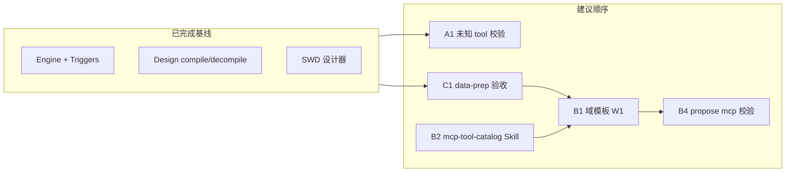

# 任务总览（2026-05-26）

> **用途**：计划 vs 代码对齐后的单一入口；按**执行顺序**排列，不按文档文件名。  
> **权威手册**：运行时见 [`WORKFLOW.md`](WORKFLOW.md)；双路线见 [`MCP-WORKFLOW-PLATFORM-PLAN.md`](MCP-WORKFLOW-PLATFORM-PLAN.md)。

---

## 一、已完成（可视为基线，仅维护回归）

| 轨道 | 交付物 | 验证 |
|------|--------|------|
| **工作流引擎** | DSL、invoke、dry-run、subflow、graph | `go test ./internal/workflow/...` |
| **NL 建流** | propose / 模板 / 审批 / 收件箱 | Slice 19b |
| **触发器** | cron + webhook + 模板真实 `triggers:` | [`WORKFLOW.md`](WORKFLOW.md) §10；E2E 76–78 |
| **可视化设计器** | `WorkflowDesign` compile/decompile | `design_*` 单测 |
| **SWD 画布（21e）** | 唯一编辑画布、动态工具箱、右栏表单 | `npm test` + `npm run build` |
| **只读流程图** | `WorkflowGraphPreview`（无 Builder SDK） | 概览 / 提案 Tab |
| **试运行 UX** | SSE `invoke/stream`、中文时间线、表达式预设 | 手工 `e2e-mock-chain` ok/degraded |
| **P0 mock MCP** | `e2e-mock.*` 三工具 + 黄金链 YAML | compose 示例 |

---

## 二、当前任务（建议执行顺序）

### 阶段 A — 设计器收尾（小，1–3 天）

| ID | 任务 | 产出 | 优先级 |
|----|------|------|--------|
| **A1** | SWD `validatorConfiguration`：未知 `tool` 在画布标红 | `SequentialWorkflowDesignerPane` 对照 `tool-schemas` | P1 |
| **A2** | 扩展 `swdAdapter` 边界单测（空流、深层 if、orphan） | 防回归 | P2 |
| **A3** | Playwright：登录 → 打开 mock chain → 选中一步 → compile | `debug-workflow-designer.py` 或新 spec | P2（可选） |
| **A4** | 部署后冒烟 | `docker compose build server` + 硬刷新 WebUI | 每次发版 |

**明确不做（除非重新选型）**：`sequential-workflow-editor` 嵌入 SWD 内置表单 → 见 `swdEditorBridge.ts`（`deferred`，右栏为唯一参数入口）。

---

### 阶段 B — 路线 2：工作流应用（主产品增量）

| ID | 任务 | 说明 | 优先级 |
|----|------|------|--------|
| **B1** | **W1** 域专用 workflow 模板 | 如 `order-sync`；`SuggestedTools` 用真实 `mcp.*` | P1 |
| **B2** | **W2** `mcp-tool-catalog` Skill | 建流时注入 `GET /tools` 清单，减少幻觉 tool 名 | P1 |
| **B3** | 模板 slot 默认选已注册 MCP | 改 `template/catalog.go` + 市场文案 | P1 |
| **B4** | **W4** propose 时校验 DSL 中 `mcp.*` 存在 | 后端或 propose 路径 | P2 |
| **B5** | **W5** workflow ↔ MCP 版本兼容矩阵 | 文档 + 可选 DB 字段 | P3 |
| **B6** | 应用市场（按域浏览 workflow） | 路线图迭代 3 | P3 |

**已并入基线（勿重复排期）**：W0 设计器 + 21e SWD；W3 试运行 inputs 表单（`InvokeInputsForm`）✅。

---

### 阶段 C — 路线 1：MCP 能力域

| ID | 任务 | 说明 | 优先级 |
|----|------|------|--------|
| **C1** | **data-prep 运营验收** | LLM + `/data/inbox|outbox`；见 [`domains/data-prep.md`](domains/data-prep.md) | P1 |
| **C2** | `data-prep-pipeline` 生产试运行 | compose 示例 + runs 含 stats | P1 |
| **C3** | **M1** `examples/mcp-services/` 脚手架 | Go MCP 模板，降新域成本 | P1 |
| **C4** | 第二域 MCP（notify / orders 等） | 路线图 §7.2+ | P2 |

**阻塞规则**：DSL 引用 `mcp.x.y` 前，`GET /tools` 必须可见。

---

### 阶段 D — 验证与文档（并行）

| ID | 任务 | 说明 |
|----|------|------|
| **D1** | compose E2E **78/78** | `deploy/compose/test-e2e.sh`（发版前） |
| **D2** | NL 三路径对比实验 | [`NL-WORKFLOW-MCP-VALIDATION.md`](NL-WORKFLOW-MCP-VALIDATION.md) |
| **D3** | 路线图 §8 与 DOC-STATUS 同步 | 避免「Slice 20 待做」类漂移 |

---

## 三、任务依赖图

---

## 四、按角色看谁做什么

| 角色 | 近期重点 |
|------|----------|
| **前端** | A1、A3；B6 远期 |
| **后端 / 工作流** | B4；模板 W1（`template/` + design compile） |
| **MCP / 集成** | C1–C4；B2 Skill 与工具描述质量 |
| **平台 / QA** | D1 E2E；D2 实验；发版 A4 |

---

## 五、文档索引（查细节用）

| 主题 | 文档 |
|------|------|
| 设计器结案 | [`WORKFLOW-EDITOR-LIBRARY-EVALUATION.md`](WORKFLOW-EDITOR-LIBRARY-EVALUATION.md) |
| SWD 集成 | [`SWD-INTEGRATION-PLAN.md`](SWD-INTEGRATION-PLAN.md) |
| Slice 20 / 21e / 24 计划 | `docs/superpowers/plans/2026-05-25-slice-*` |
| 路线 2 | [`WORKFLOW-APP-ROADMAP.md`](WORKFLOW-APP-ROADMAP.md) |
| 路线 1 | [`MCP-TOOL-ROADMAP.md`](MCP-TOOL-ROADMAP.md) |
| P1 平台切片 | [`P1-ROADMAP.md`](P1-ROADMAP.md) |

**归档**：`docs/superpowers/plans/2026-05-0[1-9]*` 不再逐项维护勾选。

---

## 六、变更日志

| 日期 | 说明 |
|------|------|
| 2026-05-26 | 初版索引（文档大扫除） |
| 2026-05-26 | 重写为分阶段任务总览（A–D） |
