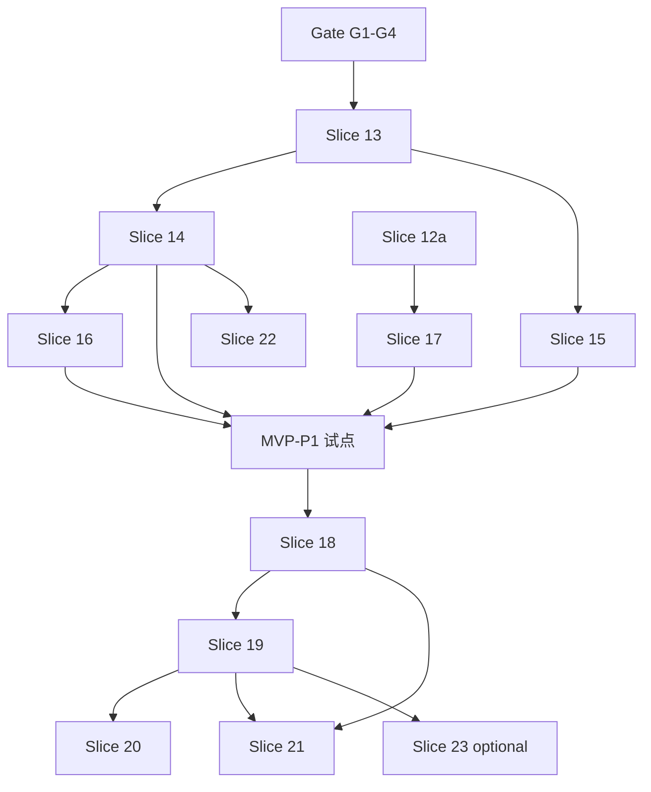

# P1 路线图 — 最小企业版 → 全量企业可用

> **状态**：已批准执行（2026-05-21）  
> **主设计**：[`docs/superpowers/specs/2026-05-18-private-ai-coding-agent-design.md`](superpowers/specs/2026-05-18-private-ai-coding-agent-design.md) §11  
> **MVP-P1 Spec**：[`docs/superpowers/specs/2026-05-21-p1-mvp-enterprise-design.md`](superpowers/specs/2026-05-21-p1-mvp-enterprise-design.md)  
> **Full P1 Spec**：[`docs/superpowers/specs/2026-05-21-p1-full-enterprise-design.md`](superpowers/specs/2026-05-21-p1-full-enterprise-design.md)  
> **验收**：[`docs/SLICE-VERIFICATION.md`](SLICE-VERIFICATION.md)

---

## 阶段总览

```text
Gate (G1–G4) ──► Slice 13–17 MVP-P1 ──► Slice 18–23 Full P1
     │                  │                      │
 E2E 1–42 全绿      E2E 43–55              E2E 56–70+
 工作区收口          企业试点               主 spec §11 字面
```

| 阶段 | 切片 | E2E 步号 | 对外宣称 |
|------|------|----------|----------|
| **Gate** | — | 1–42 | P0 收口 |
| **MVP-P1** | 13–17 | 43–55 | 企业试点 |
| **Full P1** | 18–23 | 56–70+ | 企业可用（完整） |

**建议排期（人周粗估）**：Gate 0.5 + MVP 7 + Full 12～20。

---

## Gate — 开工 Slice 13 前

| ID | 项 | 完成标准 | 状态 |
|----|-----|----------|------|
| G1 | 工作区提交 | 未提交改动（含 DashScope、流式、WebUI）已 commit | ✅ `bd21e6d` push |
| G2 | `HANDOFF.md` | HEAD、切片 1–12、本路线图一致 | ✅ |
| G3 | L1/L2/L3 | `go test ./...`、`go vet`、`test-e2e.sh` **42/42** | ✅（2026-05-21） |
| G4 | P0 spec 对齐 | 「Web 文件浏览」归入 Slice 16；session↔sandbox 归入 Slice 14 | ✅ |

**Gate 已全部清零 — 可直接开工 Slice 13。**

---

## MVP-P1（Slice 13–17）

| 切片 | 名称 | 依赖 | Plan |
|------|------|------|------|
| **13** | Enterprise Foundation | Gate | [`plans/2026-05-21-slice-13-enterprise-foundation.md`](superpowers/plans/2026-05-21-slice-13-enterprise-foundation.md) |
| **14** | Session ↔ Sandbox 强绑定 | 13 | [`plans/2026-05-21-slice-14-session-sandbox-binding.md`](superpowers/plans/2026-05-21-slice-14-session-sandbox-binding.md) |
| **15** | SSO (OIDC) | 13 | [`plans/2026-05-21-slice-15-sso-oidc.md`](superpowers/plans/2026-05-21-slice-15-sso-oidc.md) |
| **16** | Enterprise Web | 14 | [`plans/2026-05-21-slice-16-enterprise-web.md`](superpowers/plans/2026-05-21-slice-16-enterprise-web.md) |
| **17** | Skills 12b | 12a | [`plans/2026-05-21-slice-17-skills-12b.md`](superpowers/plans/2026-05-21-slice-17-skills-12b.md) |

**MVP-P1 完成定义**：SSO + 租户 provider/配额 + 会话自动沙箱 + Memory 注入/UI + Skills 12b + E2E 55 步 + 安全文档（docker.sock / seccomp 至少一项落地或书面缓解）。

**15 与 14 可并行**（不同开发者）；**16 必须在 14 之后**。

---

## Full P1（Slice 18–23）

| 切片 | 名称 | 依赖 | Plan |
|------|------|------|------|
| **18** | Sub-Agents + `agent.delegate` | MVP | [`plans/2026-05-21-slice-18-subagents-delegate.md`](superpowers/plans/2026-05-21-slice-18-subagents-delegate.md) |
| **19** | Workflow Engine | 18（可选） | [`plans/2026-05-21-slice-19-workflow-engine.md`](superpowers/plans/2026-05-21-slice-19-workflow-engine.md) |
| **20** | Reflection + 记忆合并 | 16, 19（可选） | [`plans/2026-05-21-slice-20-reflection.md`](superpowers/plans/2026-05-21-slice-20-reflection.md) |
| **21** | 编排路由 + External MCP | 18, 19 | [`plans/2026-05-21-slice-21-orchestration-mcp.md`](superpowers/plans/2026-05-21-slice-21-orchestration-mcp.md) |
| **22** | K8s + 安全深化 | 14, MVP | [`plans/2026-05-21-slice-22-k8s-production.md`](superpowers/plans/2026-05-21-slice-22-k8s-production.md) |
| **23** | N8N（可选） | 19 | [`plans/2026-05-21-slice-23-n8n-optional.md`](superpowers/plans/2026-05-21-slice-23-n8n-optional.md) — **⏭️ 跳过**（2026-05-23，非硬需求） |
| **24** | Workflow Triggers | 19b | [`plans/2026-05-24-slice-24-workflow-triggers.md`](superpowers/plans/2026-05-24-slice-24-workflow-triggers.md) — **✅** |

**19 可拆**：19a Engine ✅ + **19b Web UI ✅** + **19b NL Authoring (B+C) ✅** + **19d Visualization ✅** + **24 Triggers ✅** + **19c（模板市场 + 版本 diff）✅**。  
**23 可选**：不做仍可达 Full P1「核心」；需法务确认 N8N 许可证。

---

## 依赖图



---

## 与 HANDOFF 技术债映射

| HANDOFF §3.3 项 | 归入切片 |
|-----------------|----------|
| `providers.tenant_id` | 13 |
| per-tenant rate limit / quota | 13 |
| JWT logout / 吊销 | 13 |
| HTTP Idle/Write timeout | 13 |
| session ↔ sandbox | 14 |
| Memory 自动注入 | 16 |
| Memory UI | 16 |
| seccomp / trivy | 22（MVP 文档化可在 Gate+13） |
| Snapshot → MinIO | 22 |
| audit hash chain | 22 或 13 子集 |
| Reflection | 20 |
| Workflow | 19 |
| Hybrid 检索 | Full 之后 / 技术债 |
| Project/Tenant memory | P2 |
| Compose 试点 #11/#14/#15 | [`P2-COMPOSE-PILOT.md`](P2-COMPOSE-PILOT.md) ✅ |
| Compose 试点 #12/#13 | [`P2-COMPOSE-PILOT.md`](P2-COMPOSE-PILOT.md) ✅ |

---

## 执行顺序（给 implementer）

1. 完成 **Gate**
2. **13 → 14**（必须串行）
3. **15** 与 **14** 尾段可并行
4. **16**（依赖 14）
5. **17**（可与 15/16 并行若人力允许）
6. 打 tag / 更新 README **MVP-P1 完成**
7. **18 → 19 → 20 → 21**；**22** 视交付压力提前；**23** 最后且可选（**已跳过** → Full P1 核心完成）
8. **生产化演练** — [`PILOT-RUNBOOK.md`](PILOT-RUNBOOK.md)（备份/restore、re-embed SOP）
