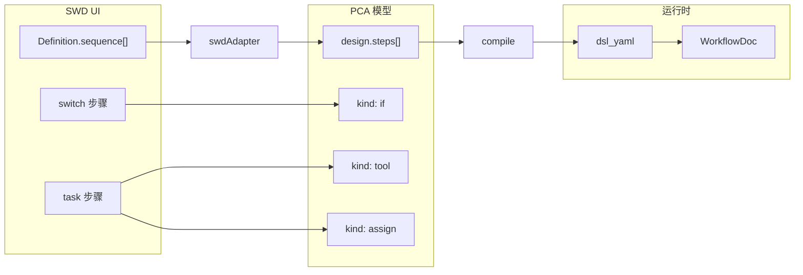

# Sequential Workflow Designer（SWD）集成方案

> **版本**：2026-05-25  
> **状态**：**21e-a/b/c/d 已完成**（2026-05-26）。设计器仅 SWD；概览流程图为 React Flow + dagre 只读预览。  
> **前置阅读**：[工作流编辑器选型](./WORKFLOW-EDITOR-LIBRARY-EVALUATION.md)、[Slice 20 可视化设计](./superpowers/specs/2026-05-25-workflow-visual-editor-design.md)

---

## 1. 目标与约束

### 1.1 目标

| 目标 | 说明 |
|------|------|
| **替换画布心智** | 用 [sequential-workflow-designer](https://github.com/nocode-js/sequential-workflow-designer) 的顺序流水线 + 条件分支，替代 Workflow Builder SDK 的自由连线画布 |
| **保留运行时真相** | Go `WorkflowDoc` / `dsl_yaml` 不变；编辑仍经 `WorkflowDesign` → `POST /admin/workflows/design/compile` |
| **保留表单能力** | `ArgsForm`、`ExprPicker`、MCP `tool-schemas`、试运行、NL 导入、专家 YAML Tab |
| **上线结果** | 21e-c 已下线 Workflow Builder；设计器仅 SWD |

### 1.2 硬约束（不可破）

```text
用户编辑 → WorkflowDesign（JSON 模型）
         → design/compile → dsl_yaml
         → 引擎执行（Go WorkflowDoc）

SWD definition 只是 UI 层中间表示，不得成为第二套持久化格式。
```

### 1.3 非目标

- 不嵌入 n8n / LogicFlow / 整包 Workflow Builder 云服务
- 不购买 SWD Pro（复制粘贴、文件夹等）；MIT 能力足够 P0/P1
- 不在本阶段改 Go DSL 语法（仅适配现有 `tool` / `assign` / `if`）

---

## 2. 现状（POC 已落地）

### 2.1 依赖

| 包 | 用途 |
|----|------|
| `sequential-workflow-designer@0.37.x` | 画布、工具箱、撤销、SVG 渲染 |
| `sequential-workflow-designer-react` | React 封装、`SequentialWorkflowDesigner` |

样式：`internal/webui/src/index.css` 已 `@import` `designer.css` + `designer-light.css`。

### 2.2 代码地图

| 路径 | 职责 |
|------|------|
| `internal/webui/src/lib/swdAdapter.ts` | `WorkflowDesign` ↔ SWD `Definition` |
| `internal/webui/src/lib/swdToolbox.ts` | 工具箱模板（tool / assign / if） |
| `internal/webui/src/components/SequentialWorkflowDesignerPane.tsx` | 嵌入组件、步骤属性面板（JSON 字段） |
| `internal/webui/src/components/WorkflowDesigner.tsx` | SWD 画布 + 侧栏步骤详情（`embedCanvasOnly` 时仅画布） |
| `internal/webui/src/components/WorkflowGraphPreview.tsx` | 概览/提案只读流程图（替代 Builder SDK） |
| `internal/webui/src/lib/swdAdapter.test.ts` | `e2e-mock-chain` round-trip |
| `internal/webui/src/components/SequentialWorkflowDesignerPane.test.tsx` | 工具箱渲染冒烟 |

### 2.3 POC 已验证

- `e2e-mock-chain` 结构（含 `if` 的 then/else）round-trip 通过单测
- 工具箱三项可见（修复：避免 `onDefinitionChange` 触发设计器反复销毁）
- 编辑 debounce → `pushDesign` → `compile` 链路复用现有 `WorkflowDesigner`

### 2.4 历史缺口（已处理）

| 原缺口 | 现状 |
|--------|------|
| 步骤 JSON 文本框 | 参数在右侧 `WorkflowDesignStepPanel`；SWD 内置 editor 折叠 |
| 静态工具箱 | `swdToolboxDynamic` + MCP `tool-schemas` |
| Builder 双轨 | **已移除** `@workflowbuilder/sdk` |
| 仅 light 主题 | `usePrefersColorScheme` → SWD `theme` light/dark |
| inputs 在 SWD 外 | 仍如此；侧栏 + 试运行表单 |

---

## 3. 数据模型映射

### 3.1 概念对照



| SWD | PCA `WorkflowDesign` | YAML 形态 |
|-----|----------------------|-----------|
| 顶层 `sequence[]` | `steps[]`（顺序列表） | 顶层 `steps:` 列表 |
| `componentType: task`, `type: tool` | `kind: tool`, `tool`, `args` | `use:` + `args:` |
| `componentType: task`, `type: assign` | `kind: assign`, `assignments` | `assign:` |
| `componentType: switch`, `type: if` | `kind: if`, `condition`, `then`, `else` | `if:` / `then:` / `else:` |
| `branches.then` / `branches.else` | `then[]` / `else[]` | 嵌套步骤 |
| `step.properties.*` | 步骤字段（含 `argsJson` 等） | 编译器解析 |
| `definition.properties` | `id`, `name`（工作流级） | `id`, `name` |

### 3.2 步骤 `type` 命名约定

POC 采用 SWD 内置扩展兼容的类型名（**非** `pca-*` 前缀）：

| `type` | `componentType` | 说明 |
|--------|-----------------|------|
| `tool` | `task` | MCP / 内置工具调用 |
| `assign` | `task` | 变量赋值 |
| `if` | `switch` | 条件分支（then / else） |

适配层对历史 `pca-tool` / `pca-assign` / `pca-if` 做只读兼容（decompile 旧图）。

### 3.3 同步策略

```text
外部 design 变更（decompile / 选工作流 / YAML 同步）
  → designSyncFingerprint 变化
  → SequentialWorkflowDesigner key 重建（整画布重载）

用户在 SWD 内编辑
  → onDefinitionChanged（debounce 300ms）
  → swdDefinitionToDesign
  → pushDesign → compileMut（不写回 SWD state，避免重建循环）
```

**原则**：父级 `design` 为源；SWD 内部状态不通过 `setDefinition` 回灌，仅 `key` + `wrapDefinition(design)` 驱动重载。

---

## 4. 目标架构

```text
┌──────────────────────────────────────────────────────────────────┐
│ /workflows → WorkflowDesigner                                     │
│  ┌────────────────────────────┐  ┌─────────────────────────────┐ │
│  │ SequentialWorkflowDesigner   │  │ 步骤详情（复用现有组件）     │ │
│  │ Pane（SWD 画布 + 工具箱）     │  │ • 选中 tool → ArgsForm      │ │
│  │                              │  │ • 选中 assign → 赋值表      │ │
│  │                              │  │ • 选中 if → ExprPicker/条件 │ │
│  └──────────────┬───────────────┘  └──────────────┬──────────────┘ │
│                 │ onDefinitionChange               │ selectedStepId │
│                 └────────────────┬─────────────────┘                 │
│                                  ▼                                 │
│                          swdAdapter.ts                             │
│                                  ▼                                 │
│                    WorkflowDesign（内存 + compile）                 │
│                                  ▼                                 │
│              POST /admin/workflows/design/compile → dsl_yaml       │
└──────────────────────────────────────────────────────────────────┘

保留不变：graph-preview（只读概览）、专家 YAML、试运行、NL 创建、模板市场
```

### 4.1 与 Workflow Builder SDK 的关系

| 阶段 | Workflow Builder SDK |
|------|----------------------|
| POC（当前） | 保留，Beta 旁切换对比 |
| 21e-a | 默认改为 SWD，Builder 降为「高级画布」 |
| 21e-c | 移除 `WorkflowBuilderCanvas`、`*workflowBuilder*` 适配（或仅留 graph-preview 用 dagre） |

---

## 5. 实施切片

### 5.1 总览

| 切片 | 名称 | 交付物 | 预估 |
|------|------|--------|------|
| **21e-POC** | 可行性验证 | `swdAdapter`、round-trip 测试 | ✅ |
| **21e-a** | 默认画布 + 选中联动 | SWD 唯一画布、侧栏步骤详情 | ✅ |
| **21e-b** | 工具箱与表单 | MCP 工具箱 + ArgsForm / ExprPicker | ✅ |
| **21e-c** | 清理与回归 | 移除 Builder；`WorkflowGraphPreview` | ✅ |
| **21e-d** | 体验打磨 | OS 深浅色、画布说明文案 | ✅ |
| **21e-b+** | sequential-workflow-editor | 暂缓（`swdEditorBridge.ts`） | ⏸ |

### 5.2 21e-a — 默认画布 + 选中联动

**目标**：SWD 成为主编辑面；步骤参数不在 SWD 内置 editor 里手敲 JSON。

| 任务 | 说明 |
|------|------|
| 默认 Tab | `WorkflowDesigner` 默认 `swd-beta`；记住用户上次选择（`localStorage`） |
| `selectedStepId` | SWD `onSelectedStepIdChanged` → 父组件 state → 驱动右侧 `ArgsForm` |
| 右侧栏布局 | 左 SWD（flex-1）+ 右详情面板（固定宽 360px），与 POC 上下堆叠解耦 |
| 步骤列表替代 | 删除或隐藏旧「步骤列表 + 插入」UI（`workflowDesignTree` 相关） |
| 只读预览 | `graph-preview` 仍在「概览」Tab；设计器 Tab 不再依赖 Builder graph 布局 |

**验收**：

- 打开 `e2e-mock-chain`：顺序与分支与 YAML 一致
- 选中 `status` 步骤：右侧显示 `ArgsForm` 且 compile 后 YAML 更新
- 拖入「调用工具」：步骤保留、compile 成功

### 5.3 21e-b — 工具箱与 schema 驱动表单

**目标**：工具箱来自真实 MCP 目录；条件/赋值用现有表达式组件。

| 任务 | 说明 |
|------|------|
| 动态工具箱 | `GET /admin/tool-schemas`（或现有 API）→ 生成 `ToolboxConfiguration.groups` |
| 工具步骤模板 | 每项：`type: tool`, `properties.tool` = schema id，默认 `args` 空对象 |
| `SwdStepEditor` 精简 | 仅保留「显示名称」；`tool`/`assign`/`if` 参数全部在右侧专用表单 |
| `ArgsForm` 接入 | 选中 `kind: tool` → 传入 `tool` + `args`，变更写回 `design.steps` 并 `compile` |
| `assign` 表单 | 复用现有赋值行 UI（或简化版） |
| `if` 条件 | `ExprPicker` + op/right 字段；then/else 仅在 SWD 画布操作顺序 |
| 校验 | compile 错误 toast；步骤级 validator（可选）标红无效 tool 名 |

**可选（21e-b+）**：[sequential-workflow-editor](https://github.com/nocode-js/sequential-workflow-editor) 按 schema 生成 SWD 内置 editor，与右侧表单二选一。

**验收**：

- 工具箱列出已注册 MCP 工具（至少 `e2e-mock.*`）
- 新建 workflow：拖入工具 → 选 schema 参数 → 试运行成功

### 5.4 21e-c — 清理与回归

| 任务 | 说明 |
|------|------|
| 移除 Workflow Builder 默认路径 | 删除 `@workflowbuilder/sdk` 依赖（评估 graph-preview 是否改自研 dagre） |
| 删除文件 | `WorkflowBuilderCanvas.tsx`、`PcaStepNodeTemplate.tsx`、`workflowBuilderAdapter.ts`、`pcaWorkflowNodes.ts` 等（保留 git 历史） |
| 测试 | 扩展 `swdAdapter.test.ts`：assign-only、空流程、深层 if；Playwright 设计器冒烟 |
| Compose | `docker compose build server` 纳入 CI 说明 |

**验收**：

- `npm test` / 关键 E2E 绿
- 包体积下降（无 `@workflowbuilder/sdk`）

### 5.5 21e-d（可选）— 体验

| 任务 | 说明 |
|------|------|
| 主题 | `theme` 跟随应用 light/dark；补充 `.swd-embed` 覆盖变量 |
| 文案 | 工具箱分组中文化；`i18n` 键与 SWD 默认英文并存 |
| 帮助 | 设计器 Tab 顶部简短说明：顺序拖入、分支在 switch 节点展开 |

---

## 6. 关键风险与对策

| 风险 | 对策 |
|------|------|
| SWD 挂载时 `onDefinitionChange` 导致空工具箱 / 闪断 | **禁止**编辑回灌 `setDefinition`；仅用 `key={syncKey}` 重载（POC 已修） |
| 未连线步骤丢失（Builder 时代问题） | SWD 顺序模型无连线；拖入即入 `sequence` |
| compile 与 decompile 环路 | 保留 `skipDecompileRef`；SWD 保存走 `pushDesign` 不触发多余 decompile |
| 双画布维护成本 | 21e-a 后 Builder 非默认；21e-c 移除 |
| `if` 分支名不一致 | 适配层固定 `then` / `else` 分支键，与 Go 编译器一致 |
| 步骤 ID 与 SWD 内部 id | 持久化以 `step.id`（SWD 节点 id）为准；工具箱模板 `stepId` 仅作拖入默认值 |

---

## 7. 测试计划

| 层级 | 内容 |
|------|------|
| 单元 | `swdAdapter` round-trip、orphan 步骤、空流程、嵌套 if |
| 组件 | `SequentialWorkflowDesignerPane` 工具箱可见、选中回调 |
| API | `design/compile` + `decompile` 与 SWD 编辑序列一致 |
| E2E | 登录 → 打开 `e2e-mock-chain` → 拖步骤 → 保存 → 试运行 |
| 手工 | `deploy/compose/examples/e2e-mock-chain.yaml` 对照画布结构 |

---

## 8. 回滚策略

| 级别 | 操作 |
|------|------|
| L1 | **无运行时开关**：21e-c 已删除 `canvasMode` / Builder 分支 |
| L2 | Git revert 21e 相关 PR（需恢复 `@workflowbuilder/sdk` 与适配文件） |
| L3 | 临时仅用专家 YAML Tab 编辑（不依赖画布） |

---

## 9. 决策记录

| 日期 | 决策 |
|------|------|
| 2026-05-24 | 选型倾向 SWD，见 [WORKFLOW-EDITOR-LIBRARY-EVALUATION.md](./WORKFLOW-EDITOR-LIBRARY-EVALUATION.md) |
| 2026-05-25 | 先落地 Workflow Builder SDK（过渡） |
| 2026-05-25 | SWD POC（画布 Beta）验证可行；推进 21e-a/b/c |
| 2026-05-26 | 已移除 `@workflowbuilder/sdk`；graph-preview 使用 `WorkflowGraphPreview`（@xyflow/react + dagre） |

---

## 10. 参考

- SWD 仓库：[nocode-js/sequential-workflow-designer](https://github.com/nocode-js/sequential-workflow-designer)
- React 包装：[sequential-workflow-designer-react](https://www.npmjs.com/package/sequential-workflow-designer-react)
- 在线 Demo：[React Demo](https://nocode-js.github.io/sequential-workflow-designer/react-app/)
- 多分支示例：[Multi-conditional Switch](https://nocode-js.github.io/sequential-workflow-designer/examples/multi-conditional-switch.html)
- 表单生成（可选）：[sequential-workflow-editor](https://github.com/nocode-js/sequential-workflow-editor)
