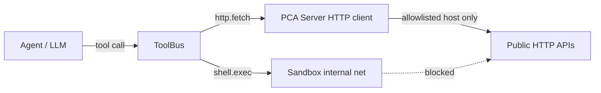

# Slice 25 — Connectors / Server-side HTTP Design

**Status:** 25a ✅ (`http.fetch`); 25b ✅ (connector catalog + template tool picker)  
**Problem:** Chat sandboxes use `internal` Docker network — no DNS/egress. Agent cannot `curl` public APIs from `shell.exec`.

**Solution:** Run outbound HTTP on the **PCA server** via ToolBus tools with strict allowlists. Agent calls `http.fetch`; server fetches and returns body/status.

---

## Architecture

| Layer | Egress |
|-------|--------|
| Sandbox (`shell.exec`, `curl`) | ❌ by design |
| Server (`http.fetch`) | ✅ when enabled + host in allowlist |
| MCP tools (Slice 21b) | ✅ server-side JSON-RPC to registered MCP servers |

---

## 25a — `http.fetch` (this slice)

### Config (`connectors.http_fetch`)

| Key | Default | Notes |
|-----|---------|-------|
| `enabled` | `false` | Tool not registered when false |
| `allow_hosts` | `[]` | Exact host or `*.example.com`; empty = deny all |
| `timeout_sec` | `30` | Client timeout |
| `max_body_bytes` | `524288` | Truncate with `truncated: true` |
| `block_private_ips` | `true` | SSRF: DNS → reject private/loopback |

Env override: `PCA_CONNECTORS_HTTP_FETCH_*` (Viper automatic env).

### Tool contract

- **Name:** `http.fetch`
- **Input:** `url` (required), `method` (GET/POST/HEAD), optional `headers`, `body`
- **Output:** `status_code`, `headers`, `body`, `truncated`, `url`
- **Mutating:** no (Dry-Run safe)
- **Profile:** `coding` allowlist includes `http.fetch` when tool is registered

### Security

1. Host must match `allow_hosts` before request.
2. When `block_private_ips`, resolve host and reject non-public IPs (blocks metadata SSRF).
3. Compose E2E sets `block_private_ips=false` only to reach `mock-provider` on the Docker network.

See also `docs/SECURITY-SANDBOX.md` §4 (sandbox vs server egress).

---

## 25b — Connector catalog (implemented)

- **`GET /admin/connectors/catalog`** — recipes: Slack, GitHub, dev-mock, http-fetch; joined with tenant MCP rows + `http.fetch` enabled flag.
- **Web UI** `/admin/connectors` — install MCP from recipe; link to MCP admin.
- **Template market** — slots with `tool_picker: notify|forward` use dropdown from `/tools` (MCP + `llm.chat` + `http.fetch`).
- Docs: [`docs/CONNECTORS.md`](../CONNECTORS.md).

---

## 25c+ (optional)

- Dedicated `connector.slack.post` wrapper tools
- NL extract prefers installed MCP notify tools over `llm.chat`

---

## Verification

- `go test ./internal/toolbus/tools/...`
- Compose E2E step **13**: tools list includes `http.fetch`; invoke `http://mock-provider:8081/healthz`
